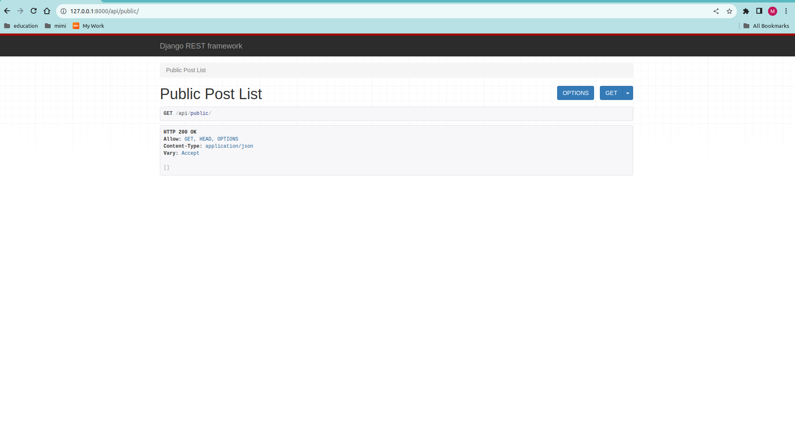

# Blog API

This repository contains a simple blog application with a RESTful API built using Django and Django REST Framework.

## Steps to Set Up the Project

1. **Install Dependencies**

   ```bash
   pip install -r requirements.txt
   ```

2. **Configure Django Settings**

   Add `'rest_framework'` to `INSTALLED_APPS` in your `settings.py` file, and update the `REST_FRAMEWORK` settings.

   ```python
   # settings.py

   INSTALLED_APPS = [
       # ... other apps
       'rest_framework',
   ]

   REST_FRAMEWORK = {
       'DEFAULT_PERMISSION_CLASSES': [
           'rest_framework.permissions.AllowAny',
       ],
       # ... other settings
   }
   ```

3. **Define Models**

   Ensure your `models.py` file includes the necessary models, such as `Post` and `UserProfile`.

   ```python
   # models.py

   from django.db import models
   from django.contrib.auth.models import User

   class UserProfile(models.Model):
       # ... fields for user profile

   class Post(models.Model):
       # ... fields for blog posts
   ```

4. **Create Serializers**

   Define serializers in `serializers.py` for your models.

   ```python
   # serializers.py

   from rest_framework import serializers
   from .models import Post, UserProfile

   class PostSerializers(serializers.ModelSerializer):
       class Meta:
           model = Post
           fields = ('posted_by', 'message', 'created_at')

   # Add serializers for UserProfile if needed
   ```

5. **Create API Views**

   Define API views in `apiviews.py` using Django REST Framework.

   ```python
   # apiviews.py

   from rest_framework.views import APIView
   from rest_framework.response import Response
   from .models import Post
   from .serializers import PostSerializers

   class PublicPostList(APIView):
       def get(self, request):
           msgs = Post.objects.public_posts()[:5]
           data = PostSerializers(msgs, many=True).data
           return Response(data)
   ```

6. **Update URLs**

   Update your `urls.py` file to include the API endpoint.

   ```python
   # urls.py

   from django.urls import path
   from .apiviews import PublicPostList

   urlpatterns = [
       # ... other paths
       path('api/public/', PublicPostList.as_view(), name='api_public'),
   ]
   ```

7. **Run Migrations**

   Apply migrations to set up the database.

   ```bash
   python manage.py makemigrations
   python manage.py migrate
   ```

8. **Run the Development Server**

   ```bash
   python manage.py runserver
   ```

   Visit http://127.0.0.1:8000/api/public/ to test your API.

## Screenshots

Include any relevant screenshots or images to showcase the API in action.


